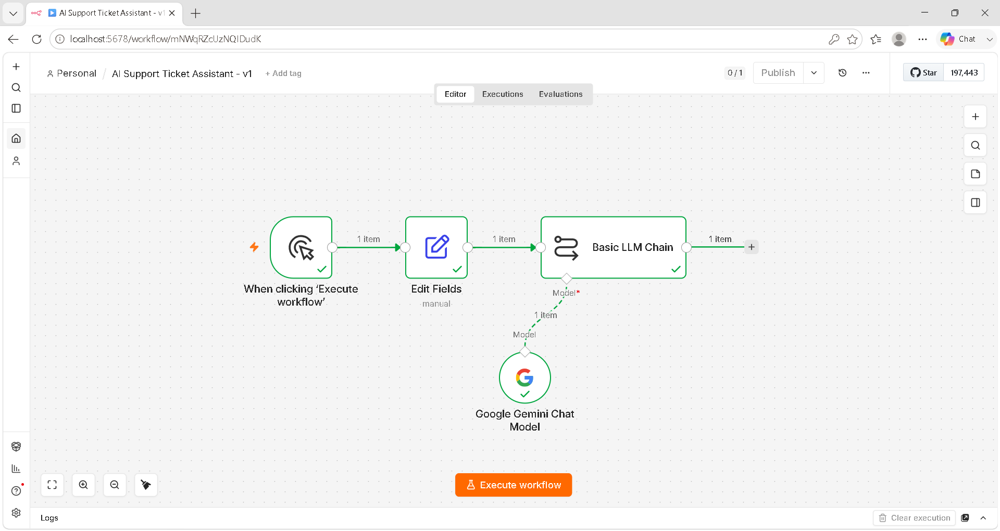
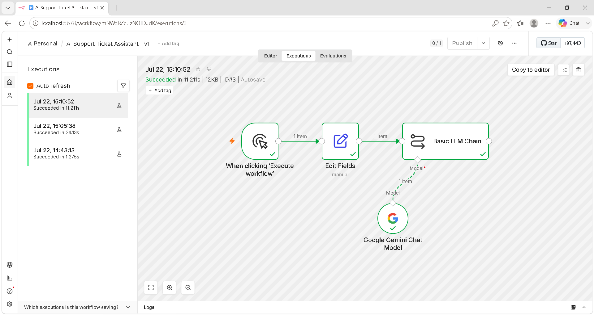
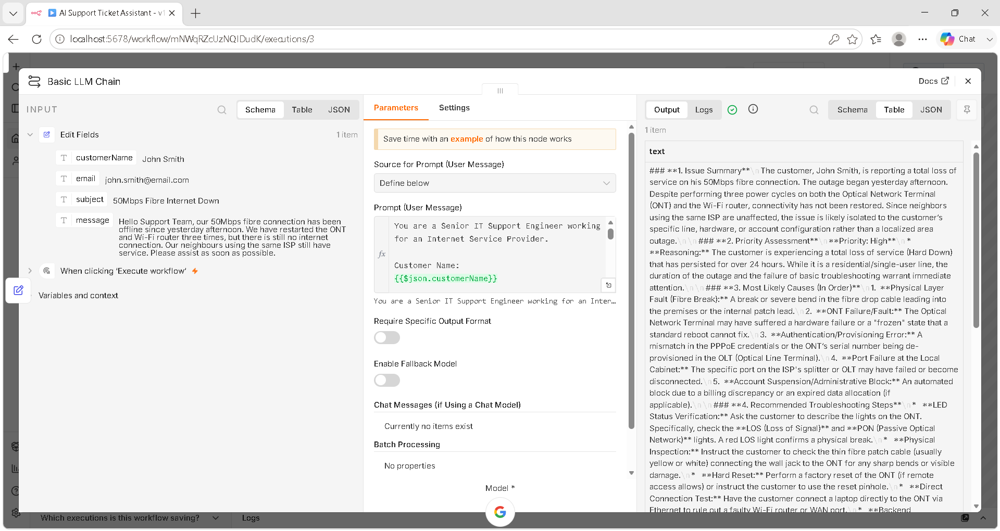

# 🤖 AI Support Ticket Assistant

An AI-powered IT Support Ticket Assistant built with **n8n** and **Google Gemini**. The workflow analyzes customer support requests, assigns a priority, recommends troubleshooting steps, suggests escalation paths, and generates professional customer responses.

This project demonstrates how workflow automation and generative AI can improve IT Service Management (ITSM) processes by reducing manual effort and providing consistent, high-quality technical support.

---

## 🚀 Features

- AI-powered support ticket analysis
- Automatic issue prioritization
- Root cause assessment
- Troubleshooting recommendations
- Professional customer response generation
- Modular n8n workflow
- Easily extendable with enterprise integrations

---

## 🛠️ Technology Stack

| Technology | Purpose |
|------------|---------|
| n8n | Workflow automation |
| Google Gemini | Large Language Model |
| Google AI Studio | API key management |
| Markdown | Documentation |
| GitHub | Version control & collaboration |

---

## 📂 Project Structure

```text
AI-Support-Ticket-Assistant/
│
├── .github/
│   └── ISSUE_TEMPLATE/
├── docs/
├── examples/
├── images/
├── prompts/
├── workflow/
│
├── CONTRIBUTING.md
├── LICENSE
├── README.md
└── .gitignore
```

---

## 📸 Screenshots

### Workflow



### Successful Execution



### AI Output



---

## ⚙️ How It Works

1. A customer support request is submitted.
2. The workflow extracts customer information.
3. Google Gemini analyzes the ticket.
4. The AI:
   - Summarizes the issue
   - Assigns a priority
   - Identifies possible causes
   - Recommends troubleshooting
   - Suggests escalation
   - Drafts a professional customer response

---

## 📦 Installation

1. Clone this repository.

```bash
git clone https://github.com/LuthandoYekani/AI-Support-Ticket-Assistant.git
```

2. Import the workflow JSON into n8n.

3. Create a Google Gemini API credential.

4. Connect the credential to the Google Gemini Chat Model node.

5. Execute the workflow.

Detailed setup instructions are available in the **docs/** folder.

---

## 📖 Documentation

- docs/architecture.md
- docs/installation.md
- docs/troubleshooting.md
- docs/future-roadmap.md

---

## 📄 Examples

The **examples/** directory contains:

- Sample customer support ticket
- Sample AI-generated technical assessment

---

## 🗺️ Roadmap

Planned future enhancements include:

- Gmail integration
- Jira integration
- ServiceNow integration
- Microsoft Teams notifications
- Slack notifications
- Retrieval-Augmented Generation (RAG)
- AWS deployment
- Docker support
- Kubernetes deployment
- Multi-tenant SaaS platform

---

## 🤝 Contributing

Contributions, feature requests, and bug reports are welcome.

Please read **CONTRIBUTING.md** before submitting changes.

---

## 📜 License

This project is licensed under the MIT License.

---

## 👨‍💻 Author

**Luthando Yekani**

Cybersecurity | AI Automation | Cloud | IT Support

GitHub: https://github.com/LuthandoYekani
