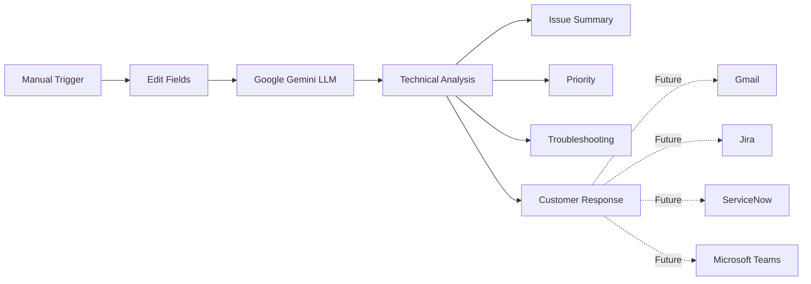

# System Architecture

## Overview

The AI Support Ticket Assistant is an intelligent workflow built using n8n and Google Gemini.

It automates the first stage of technical support by analysing incoming customer support requests and generating a structured technical assessment.

---

## Architecture

---

## Technologies

- n8n
- Google Gemini
- JSON
- REST APIs
- AI Prompt Engineering

---

## Future Enhancements

- Automatic Gmail monitoring
- Jira ticket creation
- ServiceNow incident creation
- Microsoft Teams notifications
- Knowledge Base integration
- Customer sentiment analysis
